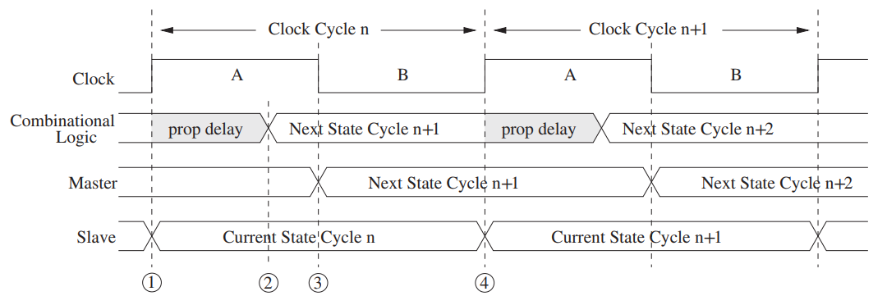

# Introduction to Computing Systems

## Chapter 1 Welcome Aboard

### Two very important ideas

1. All computers are capable of computing exactly the same things if they are given enough time and memory.

2. It is necessary to transform our problem from the language of humans to the voltages that influence the flow of electrons.

### Levels of Transformation

<figure markdown>
{ width="300" align="center" loading="lazy" }
<figcaption>Levels of transformation</figcaption>
</figure>

??? question "The most important characteristic of natural languages that prevents them from being used as programming languages?"
    Ambiguity!

#### Algorithm

Relative terms:

- definteness: each step is precisely stated.

- effective computability: each step can be carried out by a computer.

- finiteness: the procedure terminates.

#### ISA

> Instruction Set Architecture

The number of opcodes, data types, and addressing modes are specified by the ISA.

## Chapter 2 Bits, Data Types, and Operations

### 2's Complement

- 补码的补码是原码

- 负数的补码是对应正数各位取反加一

- 补码相加时，需要符号扩展

- （加法的）溢出仅发生于同号相加产生异号的情况

???+ question
    -44补码？

??? success "answer"
    0xD4

### Floating Point Data Type

> [IEEE 754](https://ieeexplore.ieee.org/document/8766229)

32-bit single precision:

| Sign | Exponent | Fraction |
| :--: | :------: | :------: |
|  1   |    8     |    23    |

$x=(-1)^s \times (1+f) \times 2^{e-127},1 \le e \le 254$

- Exponent: biased by 127 采用移码而非补码存储是为了方便比较大小

- Fraction: 只存储小数部分，整数部分默认为1（除非指数全为0）

#### Special values

|  Type   | Exponent | Fraction |
| :-----: | :------: | :------: |
| $\pm 0$ |    0     |    0     |
|   Inf   | $2^e-1$  |    0     |
|   NaN   | $2^e-1$  | non-zero |

#### Subnormal numbers

$e=0,f\ne0$

???+ example "e.g."
    - largest subnormal number: $0.11111111111111111111111\times2^{-126}$
    - smallest normalized number: $0.00000000000000000000001\times2^{-126}$

???+ question
    浮点数转十进制

    - 0 10000000 00000000000000000000000
    - 1 10000011 00010000000000000000000
    - 0 11111111 00000000000000000000000
  
??? success "answer"
      - 2
      - -17
      - $+\infty$


## Chapter 3 Digital Logic Structures

### The Transistor

#### MOS Transistor

> Metal-Oxide-Semiconductor

CMOS: Complementary MOS

<div style="display: flex; justify-content: space-around; align-items: center;">
<figure markdown>

<figcaption>P-type Mos transistor</figcaption>
</figure>

<figure markdown>

<figcaption>N-type Mos transistor</figcaption>
</figure>
</div>

| Gate   | Supplied | Connection |
| ------ | -------- | ---------- |
| P-type | 0        | 1          |
| N-type | 0        | 0          |

### Logic Gates

=== "NOT"
    <figure markdown>
    { width="200" loading="lazy" }
    </figure>

=== "OR"
    <div style="display: flex; justify-content: space-around; align-items: center;">
    <figure markdown>
    
    <figcaption>Nor Gate</figcaption>
    </figure>
    <figure markdown>
    
    <figcaption>Or Gate</figcaption>
    </figure>
    </div>

=== "AND"
    <figure markdown>
    { width="300" loading="lazy" }
    </figure>

!!! warning "Attention"
    P-type can't connect to ground, while N-type can't connect to VDD.<br/>
    否则会产生传输电压，约0.5V
    <figure markdown>
    
    <figcaption>Wrong Or Gate</figcaption>
    </figure>

#### Basic Logic Gates Symbols

<figure markdown>
{ width="350" loading="lazy" }
</figure>

### Combinational Logic Circuits

=== "Decoder"
    <figure markdown>
        <embed src="ICS/Decoder.svg" width="300" type="image/svg+xml"/>
    </figure>

=== "Mux"
    <figure markdown>
    <embed src="ICS/Mux.svg" width="300" type="image/svg+xml"/>
    </figure>

    | S   | OUT |
    | --- | --- |
    | 00  | A   |
    | 01  | B   |
    | 10  | C   |
    | 11  | D   |

=== "Full Adder"
    <figure markdown>
    { width="300" loading="lazy" }
    </figure>

    本质就是枚举

    不考虑进位的话就是一个半加器

    | $A_i$ | $B_i$ | $C_i$ | $S_i$ | $C_{i+1}$ |
    | ----- | ----- | ----- | ----- | --------- |
    | 0     | 0     | 0     | 0     | 0         |
    | 0     | 0     | 1     | 1     | 0         |
    | 0     | 1     | 0     | 1     | 0         |
    | 0     | 1     | 1     | 0     | 1         |
    | 1     | 0     | 0     | 1     | 0         |
    | 1     | 0     | 1     | 0     | 1         |
    | 1     | 1     | 0     | 0     | 1         |
    | 1     | 1     | 1     | 1     | 1         |

=== "PLA(Programmable Logic Array)"
    输入为n位时，PLA需要$2^n$个与门，或门数量取决于真值表的输出数目
    <figure markdown>
    { width="300" loading="lazy" }
    </figure>

???+ question
    How many output lines will a 16-input multiplexer have? How many select lines will this multiplexer have?

??? success "answer"
    1, 4
#### Logical Completeness

We can build a circuit to carry out the specification of any truth table we wish without using any other kind of gate.

- {AND, OR, NOT} is logically complete.

- {NAND} is logically complete.

???+ question "3.30"
    <figure markdown>
    { width="600" loading="lazy" }
    <figcaption>Diagram for Exercise 3.30.</figcaption>
    </figure>
    Construct a logic diagram that implements an adder/subtractor. That is, the logic circuit will compute A + B or A − B depending on the value of X.

??? success "answer"
    两处修改：C = NOT(B), Carry in = X  从而利用X的1实现了C = -B
    <figure markdown>
    { width="600" loading="lazy" }
    </figure>

### Basic Storage Elements

#### The R-S Latch

<figure markdown>
{ width="300" loading="lazy" }
</figure>

|   State   |  S  |  R  |
| :-------: | :-: | :-: |
| Quiescent |  1  |  1  |
|    Set    |  1  |  0  |
|   Reset   |  0  |  1  |
|  Invalid  |  0  |  0  |

#### The Gated D Latch

<figure markdown>
{ width="600" loading="lazy" }
</figure>

> WE: Write Enable

WE为1时，输出和输入一致；WE为0时，输出保持

### Memory

> Address Space: the number of addressable locations    e.g. 32-bit address space: $2^{32}$

> Addressability: the number of bits stored in each locations   Most memories are byte-addressable.

???+ example
    A 2-gigabyte memory (written 2GB) is a memory consisting of 2,147,483,648 memory locations, each containing one byte (i.e., eight bits) of storage.

???+ example "A $2^2$-by-3-Bit Memory"
    <figure markdown>
    { width="600" loading="lazy" }
    </figure>
    4bit的寻址空间，每个空间可以存储3bit的数据

!!! warning "Attention"
    Address Space 是最大可寻址空间
    <figure markdown>
    { width="600" loading="lazy" }
    </figure>
    虽然图上只画了3bit的寻址空间，但最大可寻址空间为$2^2=4$bits

    Address Space = 4, Addressability = 4

???+ question "5.2"
    A memory’s addressability is 64 bits. What does that tell you about the size of the MAR and MDR?

??? success "answer"
    We can not determine the size of MAR. MDR should be 64 bits. 
### Sequential Logic Circuits

> 组合逻辑电路只存储当前状态，而时序逻辑电路还存储了历史状态

<figure markdown>
{ width="400" loading="lazy" }
</figure>

用于实现有限状态机

#### Master-Slave Flip-Flop

<figure markdown>
{ width="600" loading="lazy" }
<br/>

<figcaption>Timing Diagram</figcaption>
</figure>

???+ question "3.53"
    The master/slave flip-flop we introduced in the chapter is shown below.
    Note that the input value is visible at the output after the clock transitions from 0 to 1.
    <figure markdown>
    { width="600" loading="lazy" }
    </figure>
    Shown below is a circuit constructed with three of these flip-flops.
    <figure markdown>
    { width="600" loading="lazy" }
    </figure>
    Fill in the entries for D2, D1, D0 for each of clock cycles shown.
    <figure markdown>
    { width="600" loading="lazy" }
    </figure>
    In ten words or less, what is this circuit doing?

??? success "answer"
    |   |cycle0 | cycle1 | cycle2 | cycle3 | cycle4 | cycle5 | cycle6 | cycle7 |
    | - |------ | ------ | ------ | ------ | ------ | ------ | ------ | ------ |
    | D2| 0     | 1      | 1      | 1      | 1      | 0      | 0      | 0      |
    | D1| 0     | 1      | 1      | 0      | 0      | 1      | 1      | 0      |
    | D0| 0     | 1      | 0      | 1      | 0      | 1      | 0      | 1      |
    
    - Enumerate all states of a 3-bit binary number.

    - A self reducing device.

    - Extend the time of one clock cycle.
## Chapter 4 The Von Neumann Model

### Basic Components

- Memory

- Processing Unit

- Input/Output

- Control Unit

### Instruction Cycle

- Fetch

- Decode

- Evaluate Address

- Fetch Operands

- Execute

- Store Results

### The State Machine

<figure markdown>
{ width="700" loading="lazy" }
{ width="700" loading="lazy" }
</figure>

## Chapter 5 The LC-3

### Condition Codes

- N, Z, P: Negative, Zero, Positive

    有且仅有一个为1

会Set CC的指令：ADD, AND, NOT, LD, LDI, LDR

### Addressing Modes

- PC-Relative

    LD, ST

- Indirect

    LDI, STI

- Base+Offset

    LDR, STR

???+ question "5.4"
    Say we have a memory consisting of 256 locations, and each location contains 16 bits.
    a. How many bits are required for the address?
    b. If we use the PC-relative addressing mode, and want to allow control transfer between instructions 20 locations away, how many bits of a branch instruction are needed to specify the PC-relative offset?
    c. If a control instruction is in location 3, what is the PC-relative offset of address 10? Assume that the control transfer instructions work the same way as in the LC-3.

??? success "answer"
    a. 8 bits.
    b. 6 bits. Since for $n$ bit offset, we can represent the range $-2^{n-1}+1$ to $2^{n-1}$.(PC has be incremented)
    c. 6.Since when we calculate PC+offset, the PC has been incremented, which means PC points to the instruction after the control instruction, so here $PC=3+1=4$.

### Data Path

加入中断后的data path不做要求

<figure markdown>
{ width="700" loading="lazy" }
</figure>

#### ALUK

It controls the operation performed in the ALU (***ADD, AND, or NOT***) during the current clock cycle.

#### Global Bus

tri-state device : it allows the computer’s control logic to enable exactly one supplier to
provide information to the bus at any one time.

*[tri-state device]: 三态门


???+ question "5.58"
    Let’s use the unused opcode to implement a new instruction, as shown below:
    <figure markdown>
    { width="500" loading="lazy" }
    </figure>
    To accomplish this, we will need a small addition to the data path, shown below in boldface:
    <figure markdown>
    { width="700" loading="lazy" }
    </figure>
    The following five additional states are needed to control the data path to carry out the work of this instruction.
    <figure markdown>
    { width="700" loading="lazy" }
    </figure>
    Note: State B loads the negative of the contents of MDR into TEMP.<br/>
    a. Complete the following table by identifying the values of the control signals needed to carry out the work of each state.
    <figure markdown>
    { width="700" loading="lazy" }
    </figure>
    b. What does the new instruction do?

??? success "answer"
    a.
    <figure markdown>
    { width="700" loading="lazy" }
    </figure>
    b. 
    ```pseudocode
    if(Reg3 == mem[Reg2]):
        mem[Reg2] = Reg1
    ```

???+ question "6.26"
    During the execution of an LC-3 program, an instruction in the program starts executing at clock cycle T and requires 15 cycles to complete.<br/>
    The table lists ***ALL*** five clock cycles during the processing of this instruction, which require use of the bus. The table shows for each of those clock cycles: which clock cycle, the state of the state machine, the value on the bus, and the important control signals that are active during that clock cycle.
    <figure markdown>
    { width="900" loading="lazy" }
    </figure>

    a. Fill in the missing entries in the table.

    b. What is the instruction being processed?

    c. Where in memory is that instruction?

    d. How many clock cycles does it take memory to read or write?

    e. There is enough information above for you to know the contents of three memory locations. What are they, and what are their contents?

??? success "answer"
    a.
    <figure markdown>
    { width="900" loading="lazy" }
    </figure>

    b. LDI, R1, #2

    c. x3010

    d. 2 cycles

    e.

    | location | content |
    | -------- | ------- |
    | x3010    | xA202   |
    | x3013    | x4567   |
    | x4567    | x0000   |

## Chapter 7 Assembly Language

### Pseudo-ops

- .ORIG

- .FILL

    填充指定值

- .BLKW

    a block of word, 分配指定数量的内存空间

- .STRINGZ

    分配n+1个字节的内存空间，存储字符串，最后一个字节为x0000

- .END
## Chapter 8 Data Structures

### Stack

1. Implemented in hardware

    <figure markdown>
    { width="700" loading="lazy" }
    <figcaption>Data entries move</figcaption>
    </figure>

2. Implemented in memory

    <figure markdown>
    { width="700" loading="lazy" }
    <figcaption>Data entries do not move</figcaption>
    </figure>

## Chapter 9 I/O

### Privilege, Priority

> Privilege is about the right to do something.

> Priority is all about the urgency of a program to execute.

#### PSR
> Program Status Register
<figure markdown>
{ width="500" loading="lazy" }
</figure>

#### Organization of Memorys
USER_PSR 默认存放于x2FFF, OS_PSR 默认存放于xFFFC

<figure markdown>
{ width="500" loading="lazy" }
</figure>

### Input/Output

- Memory-Mapped I/O vs. Special I/O Instructions
  
    即通过内存地址访问I/O设备，还是通过特殊指令访问I/O设备

- Asynchronous vs. Synchronous
  
    即CPU是否需要等待I/O设备完成操作|CPU和I/O设备是否共用同一时钟

    For sysnchronous I/O, a `ready bit` is needed. 用于判断I/O设备是否完成操作避免CPU重复获取上一数据

- Interrupt-Driven vs. Polling
  
    即I/O设备主动通知CPU完成操作还是CPU主动轮询I/O设备是否完成操作

#### Keyboard

- KBDR(xFE02): Keyboard Data Register

    bits[7:0]: ASCII code

    bits[15:8]: x00

- KBSR(xFE00): Keyboard Status Register

    bit[15]: ready bit(1: stuck, 0: ready to read)

### Monitor

- DDR(xFE06): Display Data Register

    bits[7:0]: ASCII code

    bits[15:8]: x00

- DSR(xFE04): Display Status Register

    bit[15]: ready bit(0: busy, 1: ready)

### Operating System Routines(TRAP)

#### The Trap Mechanism

- A set of service routines

    LC-3最多支持256个服务程序

- A table of the starting addresses

    服务程序的入口地址存放于x0000-x00FF，称为`System Control Block`或`Trap Vector Table`

- The TRAP instruction

- A linkage

#### HALT

将 MCR (xFFFE)的第15位设置为0，停止时钟

*[MCR]: Master Control Register

程序在执行```STI R0, MCR```（停止时钟）后停止运行，后续指令不再执行。且此时无法通过程序自身重启时钟，只能通过外部硬件支持。

### Interrupts

- Interrupts Enable

    KBSR和DSR的bit[14]为IE位，为中断使能

- Priority

    PL0 to PL7

- INTV

*[INTV]: Interrupt Vector Register

    x0100-x01FF，存储中断服务程序入口地址

    键盘中断入口地址存放于x0180

- Programming

    写自定义中断服务程序时，需要额外在启动代码(x0200)处设置中断向量入口地址、中断使能位

- 轮询过程中的中断问题：

    例如在轮询monitor是否就绪时(LDI, BRzp, STI)，STI前进入中断打印字符使得monitor变为busy状态，此时中断返回后再次向DDR写入字符后，由于monitor仍处于busy状态，会导致字符丢失。

    解决方案： 
    
    1. 在整个轮询过程中禁止中断（但由于轮询时间较长，会导致高优先级中断迟迟无法运行）

    2. 在每次循环前先允许中断再禁止中断，即中断无需等待整个轮询完成，只需等待一次轮询的循环完成即可

## The Instruction Set

<figure markdown>
{ width="700" loading="lazy" }
</figure>

### JSR

将PC值自增后存入R7，将PCOffset9的值符号扩展到16位并加上PC后跳转

!!! warning
    嵌套调用时，R7的值会被覆盖，只能返回最近一层调用

### TRAP

push PSR, push (PC+1), set PSR[15] to 0, zero-extend trap vector to 16 bits and get the address from corresponding memory location(Trap Vector Table).

### RTI

pop PC, pop PSR, change the stack pointer if necessary