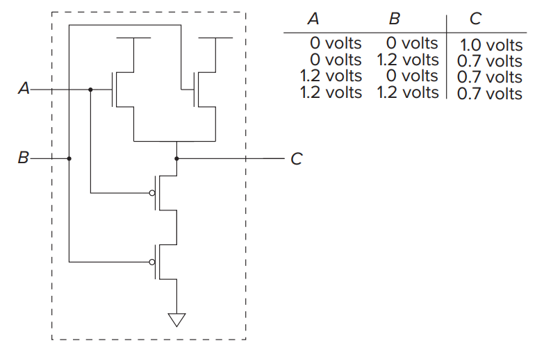

# Introduction to Computing Systems

## Chapter 1 Welcome Aboard

### Two very important ideas

1. All computers are capable of computing exactly the same things if they are given enough time and memory.

2. It is necessary to transform our problem from the language of humans to the voltages that influence the flow of electrons.

### Levels of Transformation

<figure markdown>
{ width="300" align="center" loading="lazy" }
<figcaption>Levels of transformation</figcaption>
</figure>

??? question "The most important characteristic of natural languages that prevents them from being used as programming languages?"
    Ambiguity!

#### Algorithm

Relative terms:

- definteness: each step is precisely stated.

- effective computability: each step can be carried out by a computer.

- finiteness: the procedure terminates.

#### ISA

> Instruction Set Architecture

The number of opcodes, data types, and addressing modes are specified by the ISA.

## Chapter 2 Bits, Data Types, and Operations

### 2's Complement

- 补码的补码是原码

- 负数的补码是对应正数各位取反加一

- 补码相加时，需要符号扩展

- （加法的）溢出仅发生于同号相加产生异号的情况

### Floating Point Data Type

> [IEEE 754](https://ieeexplore.ieee.org/document/8766229)

32-bit single precision:

| Sign | Exponent | Fraction |
| :--: | :------: | :------: |
|  1   |    8     |    23    |

$x=(-1)^s \times (1+f) \times 2^{e-127},1 \le e \le 254$

- Exponent: biased by 127 采用移码而非补码存储是为了方便比较大小

- Fraction: 只存储小数部分，整数部分默认为1（除非指数全为0）

#### Special values

|  Type   | Exponent | Fraction |
| :-----: | :------: | :------: |
| $\pm 0$ |    0     |    0     |
|   Inf   | $2^e-1$  |    0     |
|   NaN   | $2^e-1$  | non-zero |

#### Subnormal numbers

$e=0,f\ne0$

???+ example "e.g."
    - largest subnormal number: $0.11111111111111111111111\times2^{-126}$
    - smallest normalized number: $0.00000000000000000000001\times2^{-126}$

## Chapter 3 Digital Logic Structures

### The Transistor

#### MOS Transistor

> Metal-Oxide-Semiconductor

CMOS: Complementary MOS

<div style="display: flex; justify-content: space-around; align-items: center;">
<figure markdown>

<figcaption>P-type Mos transistor</figcaption>
</figure>

<figure markdown>

<figcaption>N-type Mos transistor</figcaption>
</figure>
</div>

| Gate   | Supplied | Connection |
| ------ | -------- | ---------- |
| P-type | 0        | 1          |
| N-type | 0        | 0          |

### Logic Gates

=== "NOT"
    <figure markdown>
    { width="200" loading="lazy" }
    </figure>

=== "OR"
    <div style="display: flex; justify-content: space-around; align-items: center;">
    <figure markdown>
    
    <figcaption>Nor Gate</figcaption>
    </figure>
    <figure markdown>
    
    <figcaption>Or Gate</figcaption>
    </figure>
    </div>

=== "AND"
    <figure markdown>
    { width="300" loading="lazy" }
    </figure>

!!! warning "Attention"
    P-type can't connect to ground, while N-type can't connect to VDD.<br/>
    否则会产生传输电压，约0.5V
    <figure markdown>
    
    <figcaption>Wrong Or Gate</figcaption>
    </figure>

#### Basic Logic Gates Symbols

<figure markdown>
{ width="350" loading="lazy" }
</figure>

### Combinational Logic Circuits

=== "Decoder"
    <figure markdown>
        <embed src="计算机系统概论/Decoder.svg" width="300" type="image/svg+xml"/>
    </figure>

=== "Mux"
    <figure markdown>
    <embed src="计算机系统概论/Mux.svg" width="300" type="image/svg+xml"/>
    </figure>

    | S   | OUT |
    | --- | --- |
    | 00  | A   |
    | 01  | B   |
    | 10  | C   |
    | 11  | D   |

=== "Full Adder"
    <figure markdown>
    { width="300" loading="lazy" }
    </figure>

    本质就是枚举

    不考虑进位的话就是一个半加器

    | $A_i$ | $B_i$ | $C_i$ | $S_i$ | $C_{i+1}$ |
    | ----- | ----- | ----- | ----- | --------- |
    | 0     | 0     | 0     | 0     | 0         |
    | 0     | 0     | 1     | 1     | 0         |
    | 0     | 1     | 0     | 1     | 0         |
    | 0     | 1     | 1     | 0     | 1         |
    | 1     | 0     | 0     | 1     | 0         |
    | 1     | 0     | 1     | 0     | 1         |
    | 1     | 1     | 0     | 0     | 1         |
    | 1     | 1     | 1     | 1     | 1         |

=== "PLA(Programmable Logic Array)"
    输入为n位时，PLA需要$2^n$个与门，或门数量取决于真值表的输出数目
    <figure markdown>
    { width="300" loading="lazy" }
    </figure>

#### Logical Completeness

We can build a circuit to carry out the specification of any truth table we wish without using any other kind of gate.

- {AND, OR, NOT} is logically complete.

- {NAND} is logically complete.

### Basic Storage Elements

#### The R-S Latch

<figure markdown>
{ width="300" loading="lazy" }
</figure>

|   State   |  S  |  R  |
| :-------: | :-: | :-: |
| Quiescent |  1  |  1  |
|    Set    |  1  |  0  |
|   Reset   |  0  |  1  |
|  Invalid  |  0  |  0  |

#### The Gated D Latch

<figure markdown>
{ width="300" loading="lazy" }
</figure>

> WE: Write Enable

### Memory

> Address Space: the number of addressable locations    e.g. 32-bit address space: $2^{32}$

> Addressability: the number of bits stored in each locations    e.g. 32-bit addressability: 32 bits

!!! warning "Attention"
    Address Space 是最大可寻址空间
    <figure markdown>
    { width="500" loading="lazy" }
    </figure>
    Address Space = 4, Addressability = 3

### Sequential Logic Circuits

> 组合逻辑电路只存储当前状态，而时序逻辑电路还存储了历史状态

#### master-slave flip-flop

<figure markdown>
{ width="600" loading="lazy" }
<br/>

<figcaption>Timing Diagram</figcaption>
</figure>

## Chapter 4 The Von Neumann Model

### Basic Components

- Memory

- Processing Unit

- Input/Output

- Control Unit

### Instruction Cycle

- Fetch

- Decode

- Evaluate Address

- Fetch Operands

- Execute

- Store Results

### The State Machine

<figure markdown>
{ width="700" loading="lazy" }
{ width="700" loading="lazy" }
</figure>

## Chapter 5 The LC-3

### Condition Codes

- N, Z, P: Negative, Zero, Positive

    有且仅有一个为1

### Addressing Modes

- PC-Relative

    LD, ST

- Indirect

    LDI, STI

- Base+Offset

    LDR, STR

### Data Path

加入中断后的data path不做要求

<figure markdown>
{ width="700" loading="lazy" }
</figure>

典型考题：设计新指令需要对数据通路做哪些修改 

#### Global Bus

tri-state device : it allows the computer’s control logic to enable exactly one supplier to
provide information to the bus at any one time.

*[tri-state device]: 三态门

## Chapter 7 Assembly Language

#### Pseudo-ops

- .ORIG

- .FILL

    填充指定值

- .BLKW

    a block of word, 分配指定数量的内存空间

- .STRINGZ

    分配n+1个字节的内存空间，存储字符串，最后一个字节为x0000

- .END
## Chapter 8 Data Structures

### Stack

1. Implemented in hardware

    <figure markdown>
    { width="700" loading="lazy" }
    <figcaption>Data entries move</figcaption>
    </figure>

2. Implemented in memory

    <figure markdown>
    { width="700" loading="lazy" }
    <figcaption>Data entries do not move</figcaption>
    </figure>

## Chapter 9 I/O

### Privilege, Priority

> Privilege is about the right to do something.

> Priority is all about the urgency of a program to execute.

#### PSR
> Program Status Register
<figure markdown>
{ width="500" loading="lazy" }
</figure>

#### Organization of Memorys
USER_PSR 默认存放于x2FFF, OS_PSR 默认存放于xFFFC

<figure markdown>
{ width="500" loading="lazy" }
</figure>

### Input/Output

- Memory-Mapped I/O vs. Special I/O Instructions

- Asynchronous vs. Synchronous

- Interrupt-Driven vs. Polling

#### Keyboard

- KBDR(xFE02): Keyboard Data Register

    bits[7:0]: ASCII code

    bits[15:8]: x00

- KBSR(xFE00): Keyboard Status Register

    bit[15]: ready bit(1: stuck, 0: ready to read)

### Monitor

- DDR(xFE06): Display Data Register

    bits[7:0]: ASCII code

    bits[15:8]: x00

- DSR(xFE04): Display Status Register

    bit[15]: ready bit(0: busy, 1: ready)

### Operating System Routines(TRAP)

#### The Trap Mechanism

- A set of service routines

    LC-3最多支持256个服务程序

- A table of the starting addresses

    服务程序的入口地址存放于x0000-x00FF，称为`System Control Block`或`Trap Vector Table`

- The TRAP instruction

- A linkage

#### HALT

将 MCR (xFFFE)的第15位设置为0，停止时钟

*[MCR]: Master Control Register

程序在执行```STI R0, MCR```（停止时钟）后停止运行，后续指令不再执行。且此时无法通过程序自身重启时钟，只能通过外部硬件支持。

### Interrupts

- Interrupts Enable

    KBSR和DSR的bit[14]为IE位，为中断使能

- Priority

    PL0 to PL7

- INTV

*[INTV]: Interrupt Vector Register

    x0100-x01FF，存储中断服务程序入口地址

    键盘中断入口地址存放于x0180

- Programming

    写自定义中断服务程序时，需要额外在启动代码(x0200)处设置中断向量入口地址、中断使能位

- 轮询过程中的中断问题：

    例如在轮询monitor是否就绪时(LDI, BRzp, STI)，STI前进入中断打印字符使得monitor变为busy状态，此时中断返回后再次向DDR写入字符后，由于monitor仍处于busy状态，会导致字符丢失。

    解决方案： 
    
    1. 在整个轮询过程中禁止中断（但由于轮询时间较长，会导致高优先级中断迟迟无法运行）

    2. 在每次循环前先允许中断再禁止中断，即中断无需等待整个轮询完成，只需等待一次轮询的循环完成即可

## Exercise

5.41(hard)

5.51(data path典型考题)