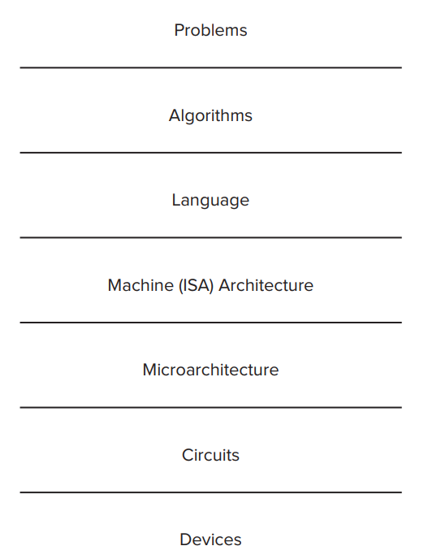
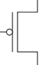
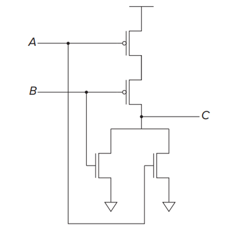
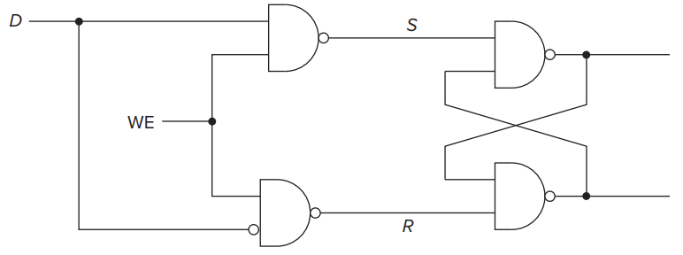

# 计算机系统概论

## Chapter 1 Welcome Aboard

### Two very important ideas

1. All computers are capable of computing exactly the same things if they are given enough time and memory.

2. It is necessary to transform our problem from the language of humans to the voltages that influence the flow of electrons.

### Levels of Transformation

<figure markdown>
{ width="300" align="center" loading="lazy" }
<figcaption>Levels of transformation</figcaption>
</figure>

??? question "The most important characteristic of natural languages that prevents them from being used as programming languages?"
    Ambiguity!

#### Algorithm

Relative terms:

- definteness: each step is precisely stated.

- effective computability: each step can be carried out by a computer.

- finiteness: the procedure terminates.

#### ISA

> Instruction Set Architecture

The number of opcodes, data types, and addressing modes are specified by the ISA.

## Chapter 2 Bits, Data Types, and Operations

### 2's Complement

- 补码的补码是原码

- 负数的补码是对应正数各位取反加一

- 补码相加时，需要符号扩展

- （加法的）溢出仅发生于同号相加产生异号的情况

### Floating Point Data Type

> [IEEE 754](https://ieeexplore.ieee.org/document/8766229)

32-bit single precision:

| Sign | Exponent | Fraction |
| :--: | :------: | :------: |
| 1    | 8        | 23       |

$x=(-1)^s\times(1+f)\times2^{e-127},1\le e\le 254$

- Exponent: biased by 127 采用移码而非补码存储是为了方便比较大小

- Fraction: 只存储小数部分，整数部分默认为1（除非指数全为0）

#### Special values

| Type | Exponent | Fraction |
| :--: | :------: | :------: |
| $\pm 0$  | 0    | 0        |
| Inf  | $2^e-1$  | 0        |
| NaN  | $2^e-1$  | non-zero |

#### Subnormal numbers

$e=0,f\ne0$

???+ example "e.g."
    - largest subnormal number: $0.11111111111111111111111\times2^{-126}$
    - smallest normalized number: $0.00000000000000000000001\times2^{-126}$

## Chapter 3 Digital Logic Structures

### The Transistor

#### MOS Transistor

> Metal-Oxide-Semiconductor

CMOS: Complementary MOS

<figure markdown>

<figcaption>P-type Mos transistor</figcaption>
</figure>

<figure markdown>

<figcaption>N-type Mos transistor</figcaption>
</figure>

### Logic Gates

=== "NOT"
    <figure markdown>
    { width="200" loading="lazy" }
    </figure>

=== "OR"
    

    <figure markdown>
    
    <figcaption>Nor Gate</figcaption>
    </figure>
    <figure markdown>
    
    <figcaption>Or Gate</figcaption>
    </figure>
    

=== "AND"
    <figure markdown>
    { width="300" loading="lazy" }
    </figure>

!!! warning "Attention"
    P-type can't connect to ground, while N-type can't connect to VDD. 
    否则会产生传输电压，约0.5V
    <figure markdown>
    
    <figcaption>Wrong Or Gate</figcaption>
    </figure>

#### Basic Logic Gates Symbols

<figure markdown>
{ width="350" loading="lazy" }
</figure>

### Combinational Logic Circuits

=== "Decoder"
    <figure markdown>
    { width="300" loading="lazy" }
    </figure>

=== "Mux"
    <figure markdown>
    { width="300" loading="lazy" }
    </figure>

=== "Full Adder"
    <figure markdown>
    { width="300" loading="lazy" }
    </figure>
=== "PLA(Programmable Logic Array)"
    输入为n位时，PLA需要$2^n$个与门，或门数量取决于真值表的输出数目
    <figure markdown>
    { width="300" loading="lazy" }
    </figure>

#### Logical Completeness

- {AND, OR, NOT} is logically complete.

- {NAND} is logically complete.

### Basic Storage Elements

#### The R-S Latch

<figure markdown>
{ width="300" loading="lazy" }
</figure>

| State | S    | R    |
| :---: | :--: | :--: |
| Quiescent | 1    | 1    |
| Set   | 1    | 0    |
| Reset | 0    | 1    |
| Invalid | 0    | 0    |

#### The Gated D Latch

<figure markdown>
{ width="300" loading="lazy" }
</figure>

> WE: Write Enable

### Memory

> Address Space: the number of addressable locations    e.g. 32-bit address space: $2^{32}$

> Addressability: the number of bits stored in each locations    e.g. 32-bit addressability: 32 bits

!!! warning "Attention"
    Address Space 是最大可寻址空间
    <figure markdown>
    { width="500" loading="lazy" }
    </figure>
    Address Space = 4, Addressability = 3

### Sequential Logic Circuits

> 组合逻辑电路只存储当前状态，而时序逻辑电路还存储了历史状态

#### master-slave flip-flop

<figure markdown>
{ width="600" loading="lazy" }
 

<figcaption>Timing Diagram</figcaption>
</figure>

## Chapter 4 The Von Neumann Model

## Chapter 5 The LC-3

## Chapter 6 Programming

## Chapter 7 Assembly Language

## Chapter 8 Data Structures

## Chapter 9 I/O